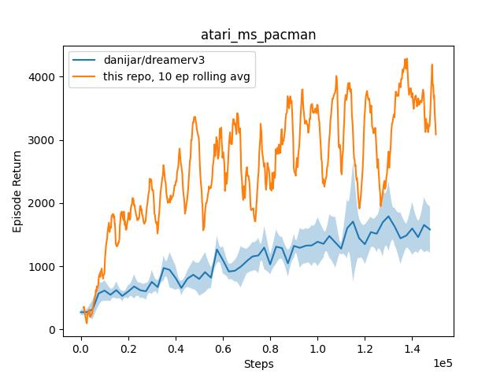
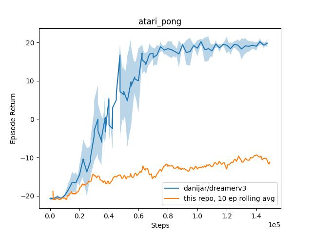

# DreamerV3
Training real robots adds non-trivial constraints:
- sample effiency: training robots is costly because of wear and tear. The less sample we use, the less parts we have to replace over time. This also means hyper-parameters tuning is less feasible.
- exploration: if training e2e (no low levels controllers), gaussian noise is unsuitable as an exploration strategy. Actuators can act as low-pass filters rendering exploration ineffective. Furthermore, gaussian noise can damage said actuators.

`CartPole-v1` is a good debug problem to try out RL aglorithms: it is well known, doesn't require much compute to run. It is also 'easy' and quick (wall clock time) to train. We're using it's physical counterpart, [a real (rotary) cartpole robot](https://github.com/Armandpl/furuta).

# Benchmarks

Not sure why that's not matching. Maybe because the official implementation is using a resnet and we're using a vanilla cnn? maybe the network sizes don't match? or maybe the training ratio?
[todo: bench against minatar breakout and space invader]

# Credits
This is based off of the following implementations:
- https://eclecticsheep.ai/2023/08/10/dreamer_v3.html
- https://github.com/NM512/dreamerv3-torch
- https://github.com/danijar/dreamerv3

This absolute banger has been useful too, no surprise: https://andyljones.com/posts/rl-debugging.html
